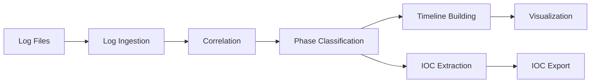
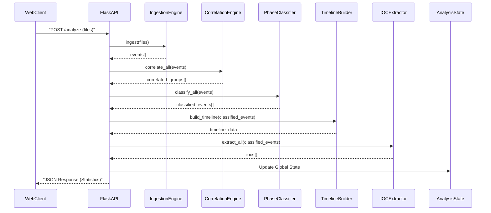

# Attack Flow Analyzer - Complete Technical Documentation

> **Purpose**: This document provides a comprehensive, function-by-function technical explanation of the Attack Flow Analyzer codebase for technical presentations.

---

## Table of Contents

1. [Architecture Overview](#architecture-overview)
2. [Configuration Module](#configuration-module)
3. [Log Ingestion Engine](#log-ingestion-engine)
4. [Correlation Engine](#correlation-engine)
5. [Phase Classifier](#phase-classifier)
6. [Timeline Builder](#timeline-builder)
7. [IOC Extractor](#ioc-extractor)
8. [IOC Exporter](#ioc-exporter)
9. [Packet Capture](#packet-capture)
10. [Packet Analyzer](#packet-analyzer)
11. [Quick Log Analysis](#quick-log-analysis)
12. [Flask Application](#flask-application)
13. [Log Generator Utility](#log-generator-utility)

---

## Architecture Overview

The Attack Flow Analyzer follows a **pipeline architecture** where data flows through multiple processing stages:



**Key Design Patterns**:
- **Strategy Pattern**: Different log parsers (Apache, Auth, Firewall, PCAP)
- **Pipeline Pattern**: Sequential processing stages
- **Repository Pattern**: IOC storage and retrieval

### Analysis Workflow Sequence

This diagram illustrates the flow of data when the `/analyze` endpoint is called:



---

## Configuration Module

**File**: [config.py](file:///Users/krishnatejag/MTech/Semester%201/Subjects/CSE/Project/attack_flow_analyzer/config.py)

### Purpose
Centralizes all configuration settings, regex patterns, and attack phase definitions.

### Key Components

#### 1. Log Format Patterns (`LOG_PATTERNS`)
```python
LOG_PATTERNS = {
    'apache_common': re.compile(...),
    'apache_combined': re.compile(...),
    'syslog_auth': re.compile(...),
    'firewall_generic': re.compile(...)
}
```

**Technical Details**:
- Uses **named capture groups** with `(?P<name>pattern)` syntax
- **Apache patterns** extract: IP, user, timestamp, HTTP method, path, status, size, referer, user-agent
- **Syslog pattern** captures: timestamp, hostname, service, PID, message
- **Firewall pattern** parses: timestamp, action (ALLOW/BLOCK), protocol, source/dest IPs and ports

**Why Regex?** Fast, flexible pattern matching for unstructured log data.

---

#### 2. Attack Phase Indicators (`ATTACK_PHASES`)

Defines detection rules for each MITRE ATT&CK phase:

**Reconnaissance Phase**:
```python
'reconnaissance': {
    'keywords': ['scan', 'nmap', 'enum', 'directory'],
    'status_codes': [404, 403],  # Failed access attempts
    'patterns': [r'/\.(git|svn|env)', r'/wp-admin'],
    'threshold': 10  # Min events to trigger
}
```

**Initial Access Phase**:
```python
'initial_access': {
    'keywords': ['login', 'auth', 'failed', 'exploit', 'sql', 'xss'],
    'status_codes': [401, 403, 500],
    'patterns': [r'SELECT.*FROM', r'<script', r'\.\.\/'],  # SQLi, XSS, Path traversal
    'threshold': 3
}
```

**Lateral Movement Phase**:
```python
'lateral_movement': {
    'keywords': ['ssh', 'rdp', 'smb', 'winrm'],
    'patterns': [r'10\.\d+\.\d+\.\d+', r'192\.168\.'],  # Internal IPs
    'threshold': 5
}
```

**Exfiltration Phase**:
```python
'exfiltration': {
    'keywords': ['upload', 'download', 'export', 'backup'],
    'patterns': [r'\.(zip|tar|gz)', r'/api/export'],
    'size_threshold': 10485760,  # 10MB
}
```

---

#### 3. IOC Extraction Patterns (`IOC_PATTERNS`)

```python
'ipv4': re.compile(r'\b(?:\d{1,3}\.){3}\d{1,3}\b'),
'domain': re.compile(r'\b(?:[a-zA-Z0-9](?:[a-zA-Z0-9-]{0,61}[a-zA-Z0-9])?\.)+[a-zA-Z]{2,}\b'),
'md5': re.compile(r'\b[a-fA-F0-9]{32}\b'),
'sha256': re.compile(r'\b[a-fA-F0-9]{64}\b'),
'url': re.compile(r'https?://[^\s<>"{}|\\^`\[\]]+')
```

**Technical Notes**:
- `\b` = word boundary to avoid partial matches
- Positive lookaheads for context-aware matching
- Character classes `[...]` for efficient scanning

---

#### 4. Correlation Settings (`CORRELATION_SETTINGS`)

```python
'session_timeout': timedelta(minutes=30),        # Session expiry
'ip_correlation_window': timedelta(hours=24),    # IP grouping window
'user_correlation_window': timedelta(days=7)     # User activity window
```

**Logic**: Events within these time windows are correlated together.

---

## Log Ingestion Engine

**File**: [modules/log_ingestion.py](file:///Users/krishnatejag/MTech/Semester%201/Subjects/CSE/Project/attack_flow_analyzer/modules/log_ingestion.py)

### Class Hierarchy

```
LogParser (Base Class)
    ├── ApacheLogParser
    ├── AuthLogParser
    ├── FirewallLogParser
    └── PcapFileParser (if scapy available)
```

---

### LogParser (Base Class)

#### `__init__(self)`
```python
def __init__(self):
    self.parsed_events = []  # Stores all parsed events
    self.errors = []         # Stores parsing errors
```

**Purpose**: Initialize storage for events and errors.

---

#### `parse_timestamp(timestamp_str, log_type) → datetime`

**Algorithm**:
1. Try a list of common timestamp formats:
   ```python
   formats = [
       '%d/%b/%Y:%H:%M:%S %z',  # Apache: 10/Jan/2024:14:30:00 +0000
       '%b %d %H:%M:%S',         # Syslog: Jan 10 14:30:00
       '%Y-%m-%d %H:%M:%S',      # ISO: 2024-01-10 14:30:00
   ]
   ```
2. Iterate through each format with `datetime.strptime()`
3. If all fail, use `dateutil.parser.parse()` as fallback (handles fuzzy parsing)
4. Return `None` if all parsing methods fail

**Why Multiple Formats?** Different log sources use different timestamp formats.

---

#### `extract_size(size_str) → int`

```python
def extract_size(self, size_str: str) -> int:
    if size_str == '-' or not size_str:
        return 0  # Handle missing sizes
    try:
        return int(size_str)
    except ValueError:
        return 0
```

**Logic**: Safely converts size strings to integers, defaulting to 0 for invalid/missing values.

---

### ApacheLogParser

#### `parse(log_file, log_format='combined') → List[Dict]`

**Algorithm**:
1. Select regex pattern based on `log_format` (common/combined)
2. Open file with UTF-8 encoding, ignoring errors
3. For each line:
   ```python
   match = pattern.match(line)
   if match:
       data = match.groupdict()  # Extract named groups
       timestamp = self.parse_timestamp(data['timestamp'], 'apache')
       event = {
           'timestamp': timestamp,
           'source_ip': data['ip'],
           'user': data['user'],
           'method': data['method'],  # GET, POST, etc.
           'path': data['path'],
           'status_code': int(data['status']),
           'size': self.extract_size(data['size']),
           'user_agent': data.get('user_agent', ''),
           'log_type': 'web_access',
           'raw_line': line
       }
   ```
4. Append valid events to list
5. Return all parsed events

**Complexity**: O(n) where n = number of lines

---

### AuthLogParser

#### `parse(log_file) → List[Dict]`

**Special Logic**:
1. Syslog doesn't include year, so add current year:
   ```python
   current_year = datetime.now().year
   timestamp_str = f"{data['timestamp']} {current_year}"
   ```

2. Extract IP from message using regex:
   ```python
   ip_match = config.IOC_PATTERNS['ipv4'].search(message)
   if ip_match:
       event['source_ip'] = ip_match.group()
   ```

3. Extract username with pattern:
   ```python
   user_match = re.search(r'user[=:]\s*(\S+)', message, re.I)
   ```

4. Determine action from message keywords:
   ```python
   if 'failed' in message.lower() or 'denied' in message.lower():
       event['action'] = 'failed_login'
   elif 'accepted' in message.lower():
       event['action'] = 'successful_login'
   ```

**Edge Cases Handled**: Missing year, unstructured message formats

---

### FirewallLogParser

#### `parse(log_file) → List[Dict]`

**Dual Parsing Strategy**:

1. **Primary**: Try strict regex pattern match
2. **Fallback**: If no match, extract IPs and infer action from keywords:
   ```python
   ip_match = config.IOC_PATTERNS['ipv4'].findall(line)
   action = 'block' if 'block' in line.lower() or 'deny' in line.lower() else 'allow'
   ```

**Why Fallback?** Firewall logs vary widely across vendors (pfSense, iptables, Cisco, etc.)

---

### LogIngestionEngine (Coordinator)

#### `__init__(self)`

```python
self.parsers = {
    'apache': ApacheLogParser(),
    'nginx': ApacheLogParser(),  # Same format
    'auth': AuthLogParser(),
    'firewall': FirewallLogParser(),
}
if PCAP_AVAILABLE:
    self.parsers['pcap'] = PcapFileParser()
```

**Design Pattern**: **Factory Pattern** — dynamically selects parser based on log type.

---

#### `detect_log_type(log_file) → str`

**Detection Algorithm**:
1. **File extension check** (highest priority):
   ```python
   if filename.endswith('.pcap') or filename.endswith('.pcapng'):
       return 'pcap'
   ```

2. **Filename keyword matching**:
   ```python
   if 'access' in filename or 'apache' in filename:
       return 'apache'
   elif 'auth' in filename or 'secure' in filename:
       return 'auth'
   ```

3. **Content sampling** (last resort):
   ```python
   sample = ''.join([f.readline() for _ in range(5)])
   if config.LOG_PATTERNS['apache_combined'].search(sample):
       return 'apache'
   ```

**Default**: Returns `'apache'` if detection fails.

---

#### `ingest(log_files, log_types=None) → List[Dict]`

**Pipeline**:
1. Validate file existence
2. Detect or use provided log type
3. Select appropriate parser
4. Parse file → events
5. Aggregate all events
6. **Sort by timestamp** (critical for timeline):
   ```python
   self.all_events.sort(key=lambda x: x['timestamp'])
   ```

**Return**: Chronologically sorted list of all events.

**Complexity**: O(n log n) due to sorting, where n = total events

---

#### `get_statistics() → Dict`

```python
return {
    'total_events': len(self.all_events),
    'log_types': self._count_by_type(),
    'time_range': self._get_time_range(),
    'errors': len(self.errors)
}
```

**Helper Functions**:
- `_count_by_type()`: Groups events by `log_type` field
- `_get_time_range()`: Returns `{start, end, duration_hours}`

---

## Correlation Engine

**File**: [modules/correlation.py](file:///Users/krishnatejag/MTech/Semester%201/Subjects/CSE/Project/attack_flow_analyzer/modules/correlation.py)

### Purpose
Groups related events to identify attack patterns and campaigns.

---

### CorrelationGroup (Data Class)

```python
class CorrelationGroup:
    def __init__(self, group_id: str, correlation_type: str):
        self.group_id = group_id
        self.correlation_type = correlation_type  # 'user', 'ip', 'session'
        self.events: List[Dict] = []
        self.first_seen: Optional[datetime] = None
        self.last_seen: Optional[datetime] = None
```

#### `add_event(event)`
Updates `first_seen` and `last_seen` timestamps:
```python
if timestamp:
    if self.first_seen is None or timestamp < self.first_seen:
        self.first_seen = timestamp
    if self.last_seen is None or timestamp > self.last_seen:
        self.last_seen = timestamp
```

#### `get_duration() → timedelta`
```python
return self.last_seen - self.first_seen if both else timedelta(0)
```

---

### CorrelationEngine

#### `correlate_by_ip(events) → Dict[str, CorrelationGroup]`

**Algorithm**:
1. Sort events by timestamp for efficient windowing
2. For each event:
   - Extract `source_ip` and `destination_ip`
   - Create group keys: `"ip_src_{ip}"`, `"ip_dst_{ip}"`
3. **Time Window Check**:
   ```python
   if not group.last_seen or (timestamp - group.last_seen) <= window:
       group.add_event(event)
   ```
   Only add to group if within 24-hour window (configurable)

**Result**: Dictionary mapping IP → CorrelationGroup

**Use Case**: Track all activities from same attacker IP

---

#### `correlate_by_user(events) → Dict[str, CorrelationGroup]`

**Similar to IP correlation**, but:
- Group key: `"user_{username}"`
- Time window: 7 days (longer than IPs)
- Filters out placeholder users (`'-'`)

**Use Case**: Track compromised user accounts

---

#### `correlate_by_session(events) → Dict[str, CorrelationGroup]`

**Session-Based Grouping**:
1. Maintain `current_sessions` dict: `IP → active CorrelationGroup`
2. For each event from an IP:
   - **If session exists** and within timeout (30 min):
     ```python
     if (timestamp - session.last_seen) <= timeout:
         session.add_event(event)  # Continue session
     ```
   - **Else**: Create new session:
     ```python
     session_id = f"session_{source_ip}_{timestamp.strftime('%Y%m%d%H%M%S')}"
     ```

**Result**: Temporal grouping of events from same IP

**Use Case**: Distinguish between multiple attack sessions from same IP

---

#### `correlate_all(events) → Dict`

**Runs all 3 correlation types**:
```python
return {
    'ip': ip_groups,
    'user': user_groups,
    'session': session_groups
}
```

**Complexity**: O(n) for each correlation type, O(3n) total

---

## Phase Classifier

**File**: [modules/phase_classifier.py](file:///Users/krishnatejag/MTech/Semester%201/Subjects/CSE/Project/attack_flow_analyzer/modules/phase_classifier.py)

### Purpose
Maps events to MITRE ATT&CK attack phases using **rule-based weighted scoring**.

---

### PhaseClassifier

#### `__init__(rules_file=None)`

**Loads rules** from `rules/phase_rules.json`:
```json
{
  "reconnaissance": {
    "indicators": {
      "url_patterns": ["/admin", "/.git"],
      "status_codes": [404, 403]
    },
    "confidence_weights": {
      "url_pattern": 0.4,
      "status_code": 0.3,
      "user_agent": 0.3
    }
  }
}
```

---

### Detection Functions

#### `_check_sql_injection(event) → float`

**Patterns Detected**:
```python
sql_patterns = [
    r"SELECT.*FROM",
    r"UNION.*SELECT",
    r"DROP.*TABLE",
    r"' OR '1'='1",
    r"OR 1=1"
]
```

**Searches** in: `path`, `user_agent`, `message` fields

**Returns**: 1.0 if any pattern matches, else 0.0

---

#### `_check_failed_logins(events, event, time_window=10) → float`

**Brute Force Detection**:
1. Check if current event is a `failed_login`
2. Count failed logins from same IP in last 10 minutes:
   ```python
   window_start = timestamp - timedelta(minutes=10)
   failed_count = sum(1 for e in events 
                      if e['source_ip'] == source_ip 
                      and e['action'] == 'failed_login'
                      and window_start <= e['timestamp'] <= timestamp)
   ```
3. **Scoring**:
   ```python
   if failed_count >= 3:
       return min(1.0, failed_count / 10.0)  # Normalize to [0,1]
   ```

---

#### `classify_event(event, all_events) → Dict`

**Algorithm**:
1. **Run all detectors** for each phase
2. **Calculate weighted confidence** per phase:
   ```python
   def _calculate_confidence(self, event, phase, scores):
       weights = self.rules[phase]['confidence_weights']
       total_weight = sum(weights.values())
       
       confidence = 0.0
       for indicator, weight in weights.items():
           score = scores.get(indicator, 0.0)
           confidence += (weight / total_weight) * score
       
       return min(1.0, confidence)
   ```

3. **Select primary phase**:
   ```python
   primary_phase = max(phase_confidences.items(), key=lambda x: x[1])
   ```

4. **Threshold check** (0.1):
   ```python
   if primary_phase[1] > 0.1:
       event['attack_phase'] = primary_phase[0]
   else:
       event['attack_phase'] = 'unknown'
   ```

**Returns**: Event with `attack_phase`, `phase_confidence`, `phase_scores`

---

## Timeline Builder

**File**: [modules/timeline.py](file:///Users/krishnatejag/MTech/Semester%201/Subjects/CSE/Project/attack_flow_analyzer/modules/timeline.py)

### Purpose
Creates chronological attack timelines and calculates phase durations.

---

### TimelineBuilder

#### `build_timeline(events) → List[Dict]`

**Pipeline**:
1. **Sort events** by timestamp
2. **Group by phase**: `_group_by_phase()`
3. **Calculate durations**: `_calculate_phase_durations()`
4. **Identify transitions**: `_identify_transitions()`

---

#### `_identify_transitions()`

**Detects phase changes**:
```python
current_phase = None
for i, event in enumerate(self.timeline_events):
    phase = event.get('attack_phase')
    
    if phase != current_phase:
        transition = {
            'from_phase': current_phase,
            'to_phase': phase,
            'timestamp': event['timestamp'],
            'event_index': i
        }
        self.phase_transitions.append(transition)
        current_phase = phase
```

---

## IOC Extractor

**File**: [modules/ioc_extractor.py](file:///Users/krishnatejag/MTech/Semester%201/Subjects/CSE/Project/attack_flow_analyzer/modules/ioc_extractor.py)

### Purpose
Extracts Indicators of Compromise for threat intelligence.

---

### Functions

#### `extract_ips(events) → Dict[str, Dict]`

For each IP:
```python
ip_iocs[ip] = {
    'value': ip,
    'type': 'ip',
    'category': 'source' or 'destination',
    'first_seen': timestamp,
    'last_seen': timestamp,
    'associated_phases': set(),
    'event_count': 0,
    'is_private': self._is_private_ip(ip)
}
```

Updates `event_count` and timestamps on subsequent occurrences.

---

#### `extract_domains(events)`, `extract_hashes(events)`, `extract_urls(events)`, `extract_user_agents(events)`

Similar pattern with validation and filtering.

---

## Packet Capture & Analysis

**File**: [modules/packet_capture.py](file:///Users/krishnatejag/MTech/Semester%201/Subjects/CSE/Project/attack_flow_analyzer/modules/packet_capture.py)

### LiveCapture

#### `start_capture(duration, packet_callback) → bool`

**Threading**:
```python
self.capture_thread = threading.Thread(
    target=self._capture_worker,
    args=(duration,),
    daemon=True
)
self.capture_thread.start()
```

#### `_capture_worker(duration)`

**Packet Handler**:
```python
def packet_handler(packet):
    self.capture_queue.put(packet)
    
    if self.packet_callback:
        event = parser._packet_to_event(packet, "live_capture")
        self.packet_callback(event)  # Real-time WebSocket emit
    
    if packet_count >= self.packet_count:
        self.stop_event.set()

sniff(prn=packet_handler, stop_filter=lambda x: self.stop_event.is_set(), ...)
```

---

**File**: [modules/packet_analyzer.py](file:///Users/krishnatejag/MTech/Semester%201/Subjects/CSE/Project/attack_flow_analyzer/modules/packet_analyzer.py)

### Attack Detection

#### `detect_port_scan(events)`

Groups ports per `source_ip:dest_ip`, flags if ≥ 10 ports scanned.

#### `detect_syn_flood(events)`

Counts SYN vs SYN-ACK packets, detects imbalance.

#### `detect_dns_exfiltration(events)`

Checks for long domain names (> 50 chars) and base64-like patterns.

---

## Quick Log Analysis

**File**: [static/js/log_analysis.js](file:///Users/krishnatejag/MTech/Semester%201/Subjects/CSE/Project/attack_flow_analyzer/static/js/log_analysis.js)

### Purpose
Provides client-side instant attack detection for log files and live captured packets without server processing.

---

### Key Functions

#### `checkCapturedPackets()`

**Algorithm**:
1. Fetches packet count from `/capture/packets` API endpoint
2. Updates UI to show packet availability status
3. Enables/disables analysis and download buttons based on packet count
4. Runs automatically on page load and every 5 seconds

**Implementation**:
```javascript
fetch('/capture/packets')
    .then(response => response.json())
    .then(data => {
        const packetCount = data.total || 0;
        if (packetCount > 0) {
            // Enable buttons, show success message
        } else {
            // Disable buttons, show info message
        }
    });
```

**Use Case**: Real-time status checking for captured packets

---

#### `analyzeCapturedPackets()`

**Algorithm**:
1. Fetches all captured packets from `/capture/packets` API
2. Converts packet JSON data to log text format using `convertPacketsToLog()`
3. Parses converted log using `parseLog()` function
4. Updates UI with attack detection results

**Packet-to-Log Conversion**:
```javascript
function convertPacketsToLog(packets) {
    const logLines = [];
    packets.forEach(packet => {
        const logLine = `[${timestamp}] ${protocol} ${sourceIp}:${sourcePort} -> ${destIp}:${destPort} LEN:${length} INFO:${info}`;
        logLines.push(logLine);
    });
    return logLines.join('\n');
}
```

**Format**: `[timestamp] PROTOCOL source_ip:port -> dest_ip:port LEN:length INFO:details`

---

#### `parseLog(text, filename) → Dict`

**Enhanced Attack Detection**:

**For Log Files**:
- **Brute Force**: Detects `failed password`, `authentication failure`, `invalid user` in auth/login logs
- **SQL Injection**: Detects `SELECT.*FROM`, `UNION.*SELECT`, `INSERT INTO`, `UPDATE.*SET` in access logs
- **XSS**: Detects `<script>`, `alert(`, `onerror=`, `onload=` in access logs
- **DDoS**: Detects `blocked`, `denied`, `dropped`, `syn flood`, `port scan` in firewall logs

**For Packet Data** (new):
- **Port Scan Detection**:
  ```javascript
  // Track IPs and ports
  if (!ipPortMap[sourceIp]) {
      ipPortMap[sourceIp] = new Set();
  }
  ipPortMap[sourceIp].add(destPort);
  
  // Detect if same IP connects to >10 different ports
  if (ipPortMap[ip].size > 10) {
      attacks["Port Scan"].count++;
  }
  ```

- **Suspicious Port Detection**:
  ```javascript
  const suspiciousPorts = [4444, 5555, 6666, 6667, 8080, 31337, 12345, 54321];
  if (suspiciousPorts.includes(destPort) || suspiciousPorts.includes(sourcePort)) {
      attacks["Suspicious Port"].count++;
  }
  ```

- **DDoS Detection**: Large packet sizes (`LEN:\d{4,}`) or high volume patterns

**Complexity**: O(n) where n = number of log lines

---

#### `downloadCapturedPackets()`

**Implementation**:
```javascript
function downloadCapturedPackets() {
    window.location.href = '/capture/download';
}
```

**Use Case**: Downloads captured packets as `.log` file for offline analysis

---

#### `updateUI(attackData)`

**Visualization Pipeline**:
1. **Chart Creation**: Uses Chart.js to create pie chart
   ```javascript
   attackChartInstance = new Chart(ctx, {
       type: 'pie',
       data: {
           labels: chartLabels,
           datasets: [{
               data: chartCounts,
               backgroundColor: ['#FF6384', '#36A2EB', '#FFCE56', '#4BC0C0']
           }]
       }
   });
   ```

2. **Attack List**: Updates list with detected attacks and counts
3. **Details Table**: Populates table with attack type, count, severity, last detected, and suggestions

**Technologies**: Chart.js for visualization, Bootstrap for UI components

---

## Flask Application

**File**: [app.py](file:///Users/krishnatejag/MTech/Semester%201/Subjects/CSE/Project/attack_flow_analyzer/app.py)

### Key Routes

#### `GET /`
Main dashboard displaying overall statistics and phase distribution.

#### `GET /upload`
File upload interface for log files.

#### `POST /upload`
Securely uploads files with deduplication and validation.

#### `POST /analyze`
Runs full pipeline: Ingest → Correlate → Classify → Timeline → Extract IOCs.

#### `GET /timeline`
Timeline visualization page.

#### `GET /api/timeline`
API endpoint returning timeline data in JSON format.

#### `GET /phases`
Attack phases breakdown page.

#### `GET /iocs`
IOCs listing page with filtering options.

#### `GET /api/iocs`
API endpoint returning IOC data in JSON format.

#### `GET /export/iocs/<format>`
Exports IOCs in JSON or CSV format.

#### `GET /log-analysis`
Quick Log Analysis interface page with client-side attack detection.

#### `GET /packet-capture`
Packet capture interface page.

#### `POST /capture/start`
Starts live packet capture with WebSocket streaming.

**Implementation Details**:
```python
@app.route('/capture/start', methods=['POST'])
def start_capture():
    # Parse request parameters (interface, count, duration)
    # Initialize LiveCapture object
    # Set up packet callback for WebSocket emission
    # Start capture in background thread
    # Return capture status
```

**WebSocket Integration**: Uses Flask-SocketIO to emit `packet_captured` events in real-time.

#### `POST /capture/stop`
Stops live packet capture and finalizes captured events.

#### `GET /capture/status`
Returns current capture status (running, stopped, packet count).

#### `GET /capture/packets`
Returns all captured packets as JSON array.

**Serialization Logic**:
- Converts datetime objects to ISO format strings
- Skips binary payload data (too large)
- Handles nested structures recursively
- Truncates long strings to 200 characters

#### `GET /capture/download`
Downloads captured packets as a `.log` file.

**Algorithm**:
1. Fetches all captured events from `capture_state['captured_events']`
2. Converts each packet to log line format:
   ```python
   log_line = f"[{timestamp_str}] {protocol.upper()} {source_ip}:{source_port} -> {dest_ip}:{dest_port} LEN:{length} INFO:{info}"
   ```
3. Creates temporary file with all log lines
4. Returns file with `Content-Disposition: attachment` header
5. Filename format: `captured_packets_YYYYMMDD_HHMMSS.log`

**Use Case**: Export captured packets for offline analysis or sharing

#### `POST /analyze/packets`
Analyzes captured packets through full pipeline and integrates with existing analysis state.

---

## Summary

### Key Technical Highlights

**Architecture Patterns**:
- **Pipeline Architecture**: Sequential data processing stages
- **Strategy Pattern**: Multiple log parsers with common interface
- **Factory Pattern**: Dynamic parser selection based on log type
- **Observer Pattern**: WebSocket real-time packet streaming

**Algorithm Complexities**:
- Log Parsing: O(n) per file
- Event Sorting: O(n log n) for timeline construction
- Correlation: O(n) per correlation type (IP, user, session)
- Phase Classification: O(n × m) where m = number of detection rules
- IOC Extraction: O(n) with regex pattern matching
- Quick Log Analysis: O(n) client-side processing

**Performance Optimizations**:
- Compiled regex patterns for faster matching
- Hash-based correlation for O(1) lookups
- Background threading for packet capture
- Client-side processing for instant log analysis
- Efficient serialization for WebSocket emissions

### Presenting to Your Teacher

1. **Architecture**: Show pipeline diagram and component interactions
2. **Walk Through Event Flow**: 
   - **Full Pipeline**: Log → Parse → Correlate → Classify → Timeline → IOCs
   - **Quick Analysis**: Log → Client Parse → Instant Detection → Visualization
3. **Highlight Algorithms**: 
   - Weighted scoring for phase classification
   - Time-window correlation for session grouping
   - Pattern matching for attack detection
   - Port scan detection in packet analysis
4. **Demo Scenarios**:
   - Upload logs and show full analysis pipeline
   - Quick log analysis with instant results
   - Live packet capture with real-time streaming
   - Download captured packets as log file
   - Export IOCs in multiple formats
5. **Discuss**: 
   - Scalability considerations
   - Real-world use cases
   - Integration possibilities
   - Future enhancements (ML-based classification)

### New Features Summary

**Quick Log Analysis**:
- Client-side processing for instant results
- No server load for simple analysis
- Supports both file upload and live packet analysis
- Enhanced attack detection (6 attack types including Port Scan and Suspicious Port)

**Packet Download**:
- Export captured packets as standard log format
- Compatible with existing log analysis tools
- Timestamp-based filename generation
- Full packet metadata preservation

---

**Good luck with your presentation!** 🚀
